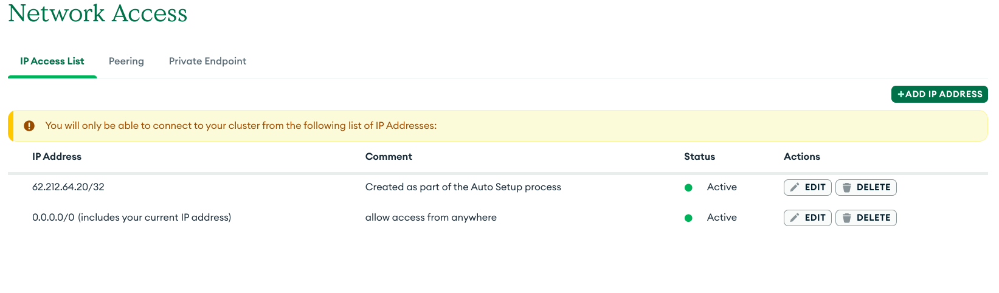

# Gtechcenter backend

Backend module for Gtechcenter project

## Prerequisites

1. **Node.js** - Download [here](https://nodejs.org/).
2. **Cloudinary account** - Create one [here](https://cloudinary.com/users/register_free).
3. **Mongodb atlas account** - Create one [here](https://www.mongodb.com/cloud/atlas/register).
4. **Include your ip in mongo_atlas ip whitelist** - 


## Set up


* Clone the project repository
   ```bash
   git clone https://github.com/stylosconsults/gtechcenter-backend.git

* Move the project directory and open cmd
   ```bash
   cd gtechcenter-backend

* Create .env file
    ```bash
    touch .env

* Set environment variables for the project
    ```bash
    PORT=<your_app_port>
    MONGO_ATLAS_URI=<your_mongo_atlas_db_connection_string>
    CLOUDINARY_CLOUD_NAME=<cloud_name>
    CLOUDINARY_API_KEY=<your_cloudinary_api_key>
    CLOUDINARY_API_SECRET=<your_cloudinary_api_secret>
    JWT_SECRET=<your_jwt_secret_key>
    GMAIL_SENDER_EMAIL=kennydebrice2@gmail.com
    GMAIL_SENDER_APP_PASSWORD=<your_app_password>
    GMAIL_G_WISSEN_RECEIVER_EMAIL=<admin_email_for_receiving_inquiries>


* Install project dependencies
   ```bash
   npm i //or
   npm install


* The Entry file is:
    ```bash
    index.ts

* Now to run project without compiling typescript files
    ```bash
    npm run dev

* To first compile ts files to dist/.js files :
    ```bash
    npm run build

* Then to run .js files directly from dist folder:
    ```bash
    npm start
